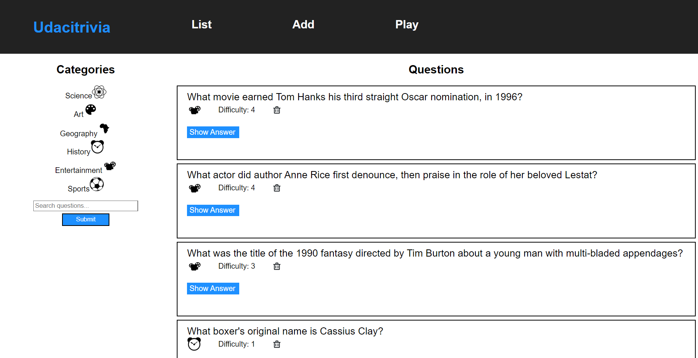

<!-- # API Development and Documentation Final Project -->
# Udacity Trivia Game Web App

> All work and no play makes jack a dull boy and fun at work makes work fun!

## Description
This project is in part-fulfilment of the requirements for the successfull completion of the ALX-T Udacity Full Stack Web Development Nanodegree program.

## Usage

This is a trivia app in which participants can browse questions and answers, add questions and play a scored quiz game based on the available questions.

### List Tab

You can familiarize yourself with the questions on the 'List' tab.
- Browse all questions by clicking 'List' at the top. 
- Browse category based questions by selecting your category of interest in the sidebar.
- Use the search feature in the sidebar to search questions. The feature returns questions that contain the search term in their question text.
- Click the 'Show Answer' button toggle display of the answer.
- Use the trash icon within each question's bounding box to delete the question.

Questions are paginated with each page containing a maximum of 10 results. Links to subsequent pages, if any, are located at the bottom of the page.

### Add Tab

You can add new questions on the 'Add' tab. 
- All fields are required.
- On successful submission of a question, all input fields are cleared and the question is added to the end of the last page of questions list on the 'List' tab.

### Play Tab
You can play the quiz on the 'Play' Tab. 

- Choose whether to play using all questions or from a particular category.
- Questions will be randomly selected for the chosen option.


- Submit your answer and you will be shown whether or not you got the answer right before you can go on to the next question.


- At the end of the game you will be shown your final score.

## Style Guide
All backend code uses the [PEP 8 style guidelines](https://www.python.org/dev/peps/pep-0008/)


## Getting Started

### About the Stack

The full stack application uses React Js on the frontend and Python Flask on the backend. 

Read the full details about the frontend stack, local dependancies and getting started in the [frontend README](./frontend/README.md).

Read the full details about the frontend stack local dependancies and getting started in the [backend README](./backend/README.md). 

## API reference

### Getting Started

At present: 
- The application is not hosted as a Base URL can only be run localy at the default ```http://localhost:5000``` which is set as a proxy in the frontend configuration
- The application does not require authentication or any API keys.

### Error Handling

Errors are returned as JSON objects in the following format:

```json
{
    "success": False, 
    "error": 405,
    "message": "method not allowed"
}
```

The API will return the following error types when requests fail:
- 400: Bad request
- 404: Resource not found
- 405: Method not allowed
- 422: Unprocessable
- 500: Server error

## Endpoints

### GET /questions
- General:
  - Returns success value, a list of questions, total number of questions, current category, list of categories.
  - Results are paginated in groups of 10. Include a request argument to choose page number, starting from 1
- Sample: 
```bash
curl http://127.0.0.1:5000/questions?page=1
```
```json
{
  "categories": [
    {
      "id": 1,
      "type": "Science"
    },
    {
      "id": 2,
      "type": "Art"
    },
    {
      "id": 3,
      "type": "Geography"
    },
    {
      "id": 4,
      "type": "History"
    },
    {
      "id": 5,
      "type": "Entertainment"
    },
    {
      "id": 6,
      "type": "Sports"
    }
  ],
  "current_category": null,
  "questions": [
    {
      "answer": "Apollo 13",
      "category": 5,
      "difficulty": 4,
      "id": 2,
      "question": "What movie earned Tom Hanks his third straight Oscar nomination, in 1996?"
    },
    {
      "answer": "Tom Cruise",
      "category": 5,
      "difficulty": 4,
      "id": 4,
      "question": "What actor did author Anne Rice first denounce, then praise in the role of her beloved Lestat?"
    },
    {
      "answer": "Edward Scissorhands",
      "category": 5,
      "difficulty": 3,
      "id": 6,
      "question": "What was the title of the 1990 fantasy directed by Tim Burton about a young man with multi-bladed appendages?"
    },
    {
      "answer": "Muhammad Ali",
      "category": 4,
      "difficulty": 1,
      "id": 9,
      "question": "What boxer's original name is Cassius Clay?"
    },
    {
      "answer": "Brazil",
      "category": 6,
      "difficulty": 3,
      "id": 10,
      "question": "Which is the only team to play in every soccer World Cup tournament?"
    },
    {
      "answer": "Lake Victoria",
      "category": 3,
      "difficulty": 2,
      "id": 13,
      "question": "What is the largest lake in Africa?"
    },
    {
      "answer": "The Palace of Versailles",
      "category": 3,
      "difficulty": 3,
      "id": 14,
      "question": "In which royal palace would you find the Hall of Mirrors?"
    },
    {
      "answer": "Agra",
      "category": 3,
      "difficulty": 2,
      "id": 15,
      "question": "The Taj Mahal is located in which Indian city?"
    },
    {
      "answer": "Escher",
      "category": 2,
      "difficulty": 1,
      "id": 16,
      "question": "Which Dutch graphic artist\u2013initials M C was a creator of optical illusions?"
    },
    {
      "answer": "Mona Lisa",
      "category": 2,
      "difficulty": 3,
      "id": 17,
      "question": "La Giaconda is better known as what?"
    }
  ],
  "success": true,
  "total_questions": 20
}
```

### POST /questions
- General:
  - Adds a new question to the game
  - Requires the question and answer text, category, and difficulty score as the data.
  - Returns success value and the id of the new question.
- Sample:  
```bash
curl -X POST -H "Content-Type: application/json" -d '{"question":"Who is the best?", "answer":"I am", "difficulty":"3", "category":"2"}' http://127.0.0.1:5000/questions
```
```json
{
  "created": 40,
  "success": true
}
```

### POST /questions/search
- General:
  - Requires the search term as the data.
  - Returns success value, total number of questions, current category, categories and a list of any questions for whom the search term is a substring of the question, .
  - Results are paginated in groups of 10. Include a request argument to choose page number, starting from 1
- Sample:  
```bash 
  curl -X POST -H "Content-Type: application/json" -d '{"searchTerm":"who"}' http://127.0.0.1:5000/questions/search
  ```

```json
{
  "current_category": null,
  "questions": [
    {
      "answer": "Alexander Fleming",
      "category": 1,
      "difficulty": 3,
      "id": 21,
      "question": "Who discovered penicillin?"
    },
    {
      "answer": "I am",
      "category": 2,
      "difficulty": 3,
      "id": 40,
      "question": "Who is the best?"
    }
  ],
  "success": true,
  "total_questions": 5
}
```

### DELETE /questions/\{question_id\}
- General:
  - Deletes the question of the given ID if it exists. 
  - Returns success value and the id of the deleted question.
- Sample: 
```bash
curl -X DELETE -H "Content-Type: application/json" http://127.0.0.1:5000/questions/40
```
```json
{
  "deleted": 40,
  "success": true
}
```

### GET /categories
- General:
  - Returns success value and a list of categories.
- Sample: 
```bash 
curl http://127.0.0.1:5000/categories
```
```json
{
  "categories": [
    {
      "id": 1,
      "type": "Science"
    },
    {
      "id": 2,
      "type": "Art"
    },
    {
      "id": 3,
      "type": "Geography"
    },
    {
      "id": 4,
      "type": "History"
    },
    {
      "id": 5,
      "type": "Entertainment"
    },
    {
      "id": 6,
      "type": "Sports"
    }
  ],
  "success": true
}
```

### GET /categories/\{category_id\}/questions
- General:
  - Returns success value, list of questions belonging to the category, total number of questions, current category, categories.
- Sample: 
```bash 
curl http://127.0.0.1:5000/categories/3/questions
```
```json
{
  "current_category": "Geography",
  "questions": [
    {
      "answer": "Lake Victoria",
      "category": 3,
      "difficulty": 2,
      "id": 13,
      "question": "What is the largest lake in Africa?"
    },
    {
      "answer": "The Palace of Versailles",
      "category": 3,
      "difficulty": 3,
      "id": 14,
      "question": "In which royal palace would you find the Hall of Mirrors?"
    },
    {
      "answer": "Agra",
      "category": 3,
      "difficulty": 2,
      "id": 15,
      "question": "The Taj Mahal is located in which Indian city?"
    }
  ],
  "success": true,
  "total_questions": 3
}
```

### POST /quizzes
- General:
  - Requires a category and a list of previous question IDs
  - Returns success value and a random question within the given category if provided, and that is not one of the previous questions.
- Sample:  
```bash
curl -X POST -H "Content-Type: application/json" -d '{"previous_questions":[25,4], "quiz_category":"4"}' http://127.0.0.1:5000/quizzes
```
```json
{
  "question": {
    "answer": "Scarab",
    "category": 4,
    "difficulty": 4,
    "id": 23,
    "question": "Which dung beetle was worshipped by the ancient Egyptians?"
  },
  "success": true
}
```

## Deployment N/a

## Authors
Tawanda .T. Nyamakope

## Acknowledgements
- Udacity Team for the stater code.
- Family for the unconditional support
- God for through Him I can do all things.


